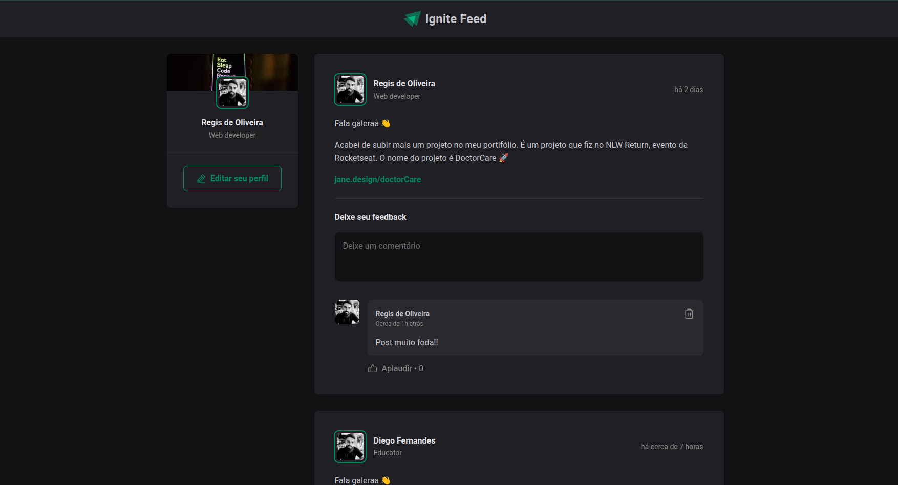

# ignite-feed-class
Project using ReactJS, Vite,  Typescript, CssModules

## :open_file_folder: App



</br>

## :key: Getting Started

```bash
# clone the repo:
git clone https://github.com/Regis-Oliveira/ignite-feed-class.git

# open the project:
cd ignite-feed-class

# install the dependencies:
npm install
# or
yarn install

#execute
npm run dev
# or
yarn dev
```

Open [http://localhost:5173](http://localhost:5173) with your browser to see the result.

</br>

## :rocket: Technologies

- [Typescript](https://www.typescriptlang.org/)
- [Vite](https://vitejs.dev/)
- [Date-fns](https://date-fns.org/)
- [PhosphorIcons](https://phosphoricons.com/)

</br>

 ## :pencil2: Contact Me

- [Linkedin](www.linkedin.com/in/regis-de-oliveira-cardoso)
- :inbox_tray: Email: (oliveiracregis01@gmail.com)

</br>

---
Desenvolvido com :heart: por **Régis de Oliveira Cardoso**.
